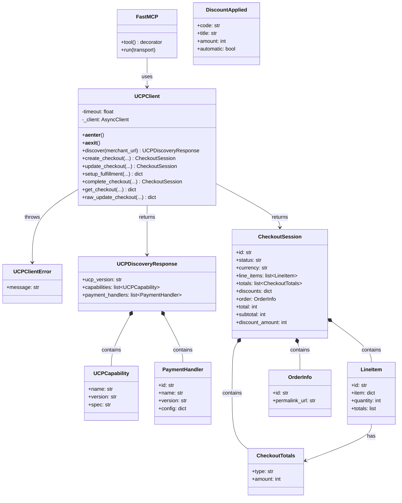
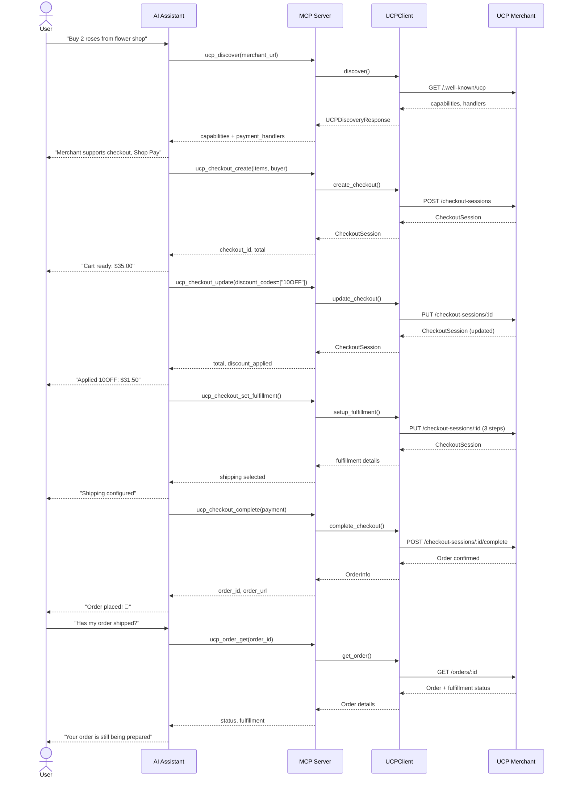

# ucp-mcp-server

**Let AI assistants shop.** An MCP server that gives Claude, Cursor, and any MCP-compatible AI the ability to interact with UCP-enabled merchants.

> **UCP** (Universal Commerce Protocol) is Google's new open standard for agentic commerce, backed by Shopify, Stripe, Visa, Mastercard, Target, Walmart, and 20+ partners.
>
> **MCP** (Model Context Protocol) is the standard for giving AI assistants access to tools.
>
> This project connects them.

---

## What Can It Do?

| Tool | Description |
|------|-------------|
| `ucp_discover` | Find out what a merchant supports (capabilities, payment methods) |
| `ucp_products_list` | List all products from a merchant's catalog |
| `ucp_products_search` | Search and filter products by color, category, location, price, specs |
| `ucp_checkout_create` | Start a purchase (add items to cart, set buyer info) |
| `ucp_checkout_update` | Apply discount codes to an existing checkout |
| `ucp_checkout_set_fulfillment` | Set up shipping (auto-selects address and delivery option) |
| `ucp_checkout_complete` | Complete the purchase by submitting payment |
| `ucp_order_get` | Get the current status of an order, including fulfillment |
| `ucp_testing_simulate_shipping` | Mark an order as shipped via the merchant's testing endpoint |

Your AI assistant gets structured, type-safe access to the entire UCP shopping flow. No scraping, no browser automation, no brittle hacks.

## Quick Start

### Install

```bash
pip install ucp-mcp-server
```

Or with [uv](https://docs.astral.sh/uv/):

```bash
uv pip install ucp-mcp-server
```

### Use with Claude Desktop

Add to your `claude_desktop_config.json`:

```json
{
  "mcpServers": {
    "ucp-shopping": {
      "command": "ucp-mcp-server"
    }
  }
}
```

### Use with Cursor

Add to your `.cursor/mcp.json`:

```json
{
  "mcpServers": {
    "ucp-shopping": {
      "command": "ucp-mcp-server"
    }
  }
}
```

### Run Directly

```bash
# As a module
python -m ucp_mcp_server

# Or via the entry point
ucp-mcp-server
```

## Tools Reference

### `ucp_discover`

Discover what a UCP merchant supports before shopping.

```
Arguments:
  merchant_url (str): Base URL of a UCP-enabled merchant

Returns:
  capabilities: List of supported UCP capabilities (checkout, discount, fulfillment)
  payment_handlers: Accepted payment methods (Shop Pay, Google Pay, etc.)
  ucp_version: Protocol version the merchant implements
```

### `ucp_products_list`

List all products from a merchant's catalog.

```
Arguments:
  merchant_url (str): Base URL of the merchant

Returns:
  products: List of products with id, title, price, and image_url
```

### `ucp_products_search`

Search and filter products from a merchant's catalog with advanced filtering.

```
Arguments:
  merchant_url (str): Base URL of the merchant
  query (str): Text search query to match against product titles
  color (str): Filter by color (e.g., "red", "blue", "black")
  category (str): Filter by category (e.g., "pc", "laptop", "monitor")
  location (str): Filter by location/availability (e.g., "Madrid", "Barcelona")
  max_price (int): Maximum price filter in cents (e.g., 200000 for 2000 EUR)
  min_price (int): Minimum price filter in cents
  sort_by (str): Sort results by "price_asc", "price_desc", or "name"
  specs (dict): Filter by specifications (e.g., {"use_case": "ai", "gpu": "RTX 4090"})

Returns:
  products: List of matching products with all fields
  total: Number of products found
  filters_applied: Summary of filters that were applied
```

**Example: Find a red PC for AI in Madrid under 2000 EUR**

```python
result = await ucp_products_search(
    merchant_url="http://localhost:8182",
    color="red",
    category="pc",
    location="Madrid",
    max_price=200000,  # 2000 EUR in cents
    specs={"use_case": "ai"},
    sort_by="price_asc",
)
# Returns: PC IA Rojo NVIDIA H100 at 1850 EUR
```

### `ucp_checkout_create`

Create a new shopping cart / checkout session.

```
Arguments:
  merchant_url (str): Base URL of the merchant
  items (list): Items to buy, each with "id" and "quantity"
  buyer_name (str): Full name of the buyer
  buyer_email (str): Email address
  currency (str): Currency code (default: "USD")

Returns:
  checkout_id: Session ID for tracking this purchase
  status: Current checkout status
  total: Total price in smallest currency unit (cents)
  subtotal: Subtotal before discounts
  line_items: What's in the cart
```

### `ucp_checkout_update`

Apply discount codes or modify an existing checkout.

```
Arguments:
  merchant_url (str): Base URL of the merchant
  checkout_id (str): The checkout session to update
  discount_codes (list[str]): Promo codes to apply

Returns:
  checkout_id: Session ID
  total: Updated total after discounts
  discount_applied: How much was saved
  discounts: Details of applied discounts
```

### `ucp_checkout_set_fulfillment`

Set up shipping for a checkout. Automatically selects the first available address and delivery option.

```
Arguments:
  merchant_url (str): Base URL of the merchant
  checkout_id (str): The checkout session

Returns:
  checkout_id: Session ID
  status: Current status
  total: Updated total (may include shipping costs)
  fulfillment: Details of selected shipping method
```

### `ucp_checkout_complete`

Complete a checkout by submitting payment. This finalizes the purchase and returns an order ID.

```
Arguments:
  merchant_url (str): Base URL of the merchant
  checkout_id (str): The checkout session to complete
  payment_handler_id (str): Payment handler to use (from ucp_discover)
  card_token (str): Payment token from the provider
  card_brand (str): Card brand (e.g., "Visa")
  card_last_digits (str): Last 4 digits of the card

Returns:
  checkout_id: Session ID
  status: "complete" or "completed"
  total: Final amount charged
  order_id: Order ID for tracking
  order_url: Permalink to the order
```

### `ucp_order_get`

Get the current status of an order, including fulfillment details.

```
Arguments:
  merchant_url (str): Base URL of the merchant
  order_id (str): The order to track

Returns:
  order_id: The order ID
  status: Current order status
  currency: Order currency
  total: Total amount charged
  fulfillment: Fulfillment details (method, tracking, status)
```

### `ucp_testing_simulate_shipping`

Simulate shipping an order via the merchant's testing endpoint. Useful for end-to-end tests and demos.

```
Arguments:
  merchant_url (str): Base URL of the merchant
  order_id (str): The order to mark as shipped

Returns:
  status: The result of the simulation (e.g., "shipped")
```

## Example Conversation

### Basic Shopping Flow

> **You:** "Find out what the flower shop at http://flowers.example.com supports"
>
> **Claude:** *calls ucp_discover* "This merchant supports checkout, discounts, and fulfillment tracking. They accept Shop Pay and Google Pay."
>
> **You:** "Buy 2 bouquets of roses for me"
>
> **Claude:** *calls ucp_checkout_create* "I've created a checkout for 2 Bouquet of Red Roses. Total: $70.00. Would you like to proceed?"
>
> **You:** "Try the code 10OFF first"
>
> **Claude:** *calls ucp_checkout_update* "Applied 10OFF - saved $7.00! New total: $63.00."

### Product Search Flow

> **You:** "I'm looking for a red PC for AI work in Madrid, budget under 2000 EUR"
>
> **Claude:** *calls ucp_products_search(color="red", category="pc", location="Madrid", max_price=200000, specs={"use_case": "ai"}, sort_by="price_asc")*
> "I found 1 matching PC: **PC IA Rojo NVIDIA H100** at **1,850 EUR**. It has 128GB RAM, AMD EPYC 9654 CPU, and NVIDIA H100 GPU. This is the cheapest option that meets your criteria. Would you like to proceed with checkout?"
>
> **You:** "Yes, add it to cart"
>
> **Claude:** *calls ucp_checkout_create* "Added to cart! Checkout session created. Total: 1,850 EUR. Ready to complete purchase?"

## Why This Exists

Every AI app is going to need shopping capabilities. UCP standardizes how merchants expose commerce APIs. MCP standardizes how AI assistants use tools. This project is the bridge.

Without this, connecting AI to commerce means:
- Scraping websites (brittle, breaks constantly)
- Building custom integrations per merchant (doesn't scale)
- Browser automation (slow, unreliable, expensive)

With UCP + MCP:
- One protocol, every merchant
- Structured data in, structured data out
- Works with any MCP-compatible AI assistant

## Development

```bash
# Clone the repo
git clone https://github.com/nguthrie/ucp-mcp-server.git
cd ucp-mcp-server

# Install dependencies
uv sync --extra dev

# Run tests
uv run pytest -v

# Run integration tests (requires a live UCP server on port 8182)
uv run pytest -v -m integration --run-integration
```

### End-to-end functional tests

The repository also ships with self-contained end-to-end scripts that start the sample UCP merchant and exercise the full shopping flow via the MCP stdio client.

```bash
# Run a single end-to-end flow against a freshly started sample merchant
uv run python scripts/test_mcp_e2e.py

# Run all built-in scenarios (single items, multiple items, discounts, out-of-stock, ...)
uv run python scripts/test_mcp_scenarios.py

# Use an already running merchant (e.g., on localhost:8182)
uv run python scripts/test_mcp_e2e.py --skip-merchant
uv run python scripts/test_mcp_scenarios.py --skip-merchant --merchant-url http://localhost:8182

# Generate a sample scenarios file to customize
uv run python scripts/test_mcp_scenarios.py --generate-sample scenarios.json
```

### Project Structure

```
ucp-mcp-server/
├── src/ucp_mcp_server/
│   ├── __init__.py        # Package version
│   ├── __main__.py        # python -m entry point
│   ├── server.py          # MCP server + tool definitions
│   ├── ucp_client.py      # HTTP client for UCP APIs
│   └── models.py          # Pydantic models for UCP data
└── tests/
    ├── conftest.py         # Test fixtures with mock UCP responses
    ├── test_discovery.py   # Discovery tool tests
    ├── test_products.py    # Product listing tests
    ├── test_product_search.py # Product search/filter tests
    ├── test_checkout.py    # Checkout tool tests
    ├── test_order.py       # Order tracking tool tests
    ├── test_errors.py      # Error handling tests
    ├── test_e2e_user_journey.py # End-to-end user journey tests
    └── test_integration.py # Live server integration tests
```

## Architecture

### System Overview

```mermaid
flowchart LR
    subgraph AI["AI Assistant"]
        A1[Claude / Cursor / MCP Client]
    end

    subgraph MCP["MCP Server Layer"]
        B1[FastMCP Server]
        B2[ucp_discover]
        B3[ucp_products_list]
        B4[ucp_products_search]
        B5[ucp_checkout_create]
        B6[ucp_checkout_update]
        B7[ucp_checkout_set_fulfillment]
        B8[ucp_checkout_complete]
        B9[ucp_order_get]
        B10[ucp_testing_simulate_shipping]
    end

    subgraph Client["HTTP Client Layer"]
        C1[UCPClient]
        C2[httpx AsyncClient]
    end

    subgraph Models["Data Models (Pydantic)"]
        D1[UCPDiscoveryResponse]
        D2[CheckoutSession]
        D3[LineItem]
        D4[PaymentHandler]
    end

    subgraph External["UCP Merchant API"]
        E1[/.well-known/ucp]
        E2[/checkout-sessions]
        E3[/checkout-sessions/:id/complete]
    end

    A1 -->|"MCP Protocol (stdio)"| B1
    B1 --> B2 & B3 & B4 & B5 & B6 & B7 & B8 & B9 & B10
    B2 & B3 & B4 & B5 & B6 & B7 & B8 & B9 & B10 --> C1
    C1 --> C2
    C2 -->|"HTTPS"| E1 & E2 & E3
    C1 --> D1 & D2 & D3 & D4
```

| Layer | Package | Purpose |
|-------|---------|---------|
| **AI Assistant** | External | MCP-compatible client (Claude, Cursor, etc.) |
| **MCP Server** | `server.py` | Tool definitions, input/output transformation |
| **HTTP Client** | `ucp_client.py` | Async HTTP calls to UCP merchant APIs |
| **Data Models** | `models.py` | Pydantic validation for requests/responses |
| **UCP Merchant** | External | Google UCP-compliant commerce server |

### Class Diagram



### Shopping Flow (Sequence)



## Roadmap

### ✅ Completed

- [x] Merchant capability discovery (`ucp_discover`)
- [x] Product catalog listing (`ucp_products_list`)
- [x] Product search and filtering (`ucp_products_search`)
- [x] Checkout session creation (`ucp_checkout_create`)
- [x] Discount code application (`ucp_checkout_update`)
- [x] Fulfillment / shipping setup (`ucp_checkout_set_fulfillment`)
- [x] Purchase completion / payment submission (`ucp_checkout_complete`)
- [x] Order fulfillment tracking (`ucp_order_get`, `ucp_testing_simulate_shipping`)
- [x] End-to-end user journey tests
- [x] UCP protocol compliance tests

### 🚧 In Progress

- [ ] Returns and exchanges

### 📋 Planned

- [ ] Multi-merchant comparison shopping
- [ ] Hosted managed version (so you don't have to self-host)

## Resources

- [UCP Specification](https://ucp.dev) - The Universal Commerce Protocol
- [UCP GitHub](https://github.com/universal-commerce-protocol/ucp)
- [UCP Python SDK](https://github.com/Universal-Commerce-Protocol/python-sdk)
- [MCP Documentation](https://modelcontextprotocol.io) - Model Context Protocol
- [Google's UCP Blog Post](https://developers.googleblog.com/under-the-hood-universal-commerce-protocol-ucp/)

## License

MIT
